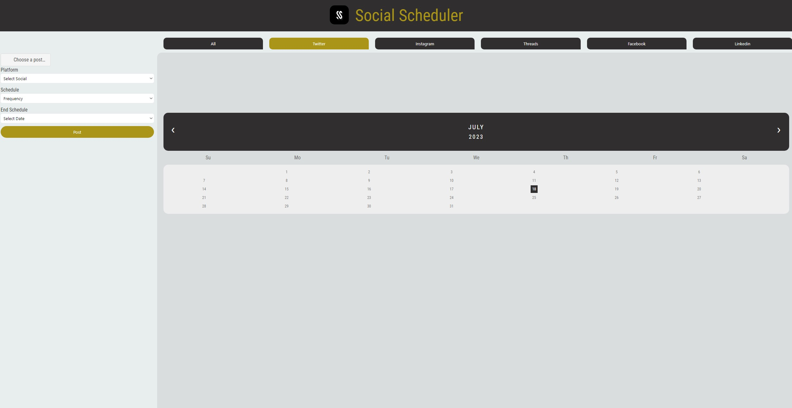

## Project 1: Day to Day Calendar

1. [ Description. ](#desc)
2. [ Web Address. ](#webadd)
3. [ Repository Address. ](#repoadd)

## 1. Description

### This is a social media scheduler built using Javascript

This is a social media scheduler that allows you to pick your platform, set a date and time, as well as add attatchments for your post.

## 2. Web Address

tbd

## Repository Address

https://github.com/wygrajr/socialMediaScheduler
